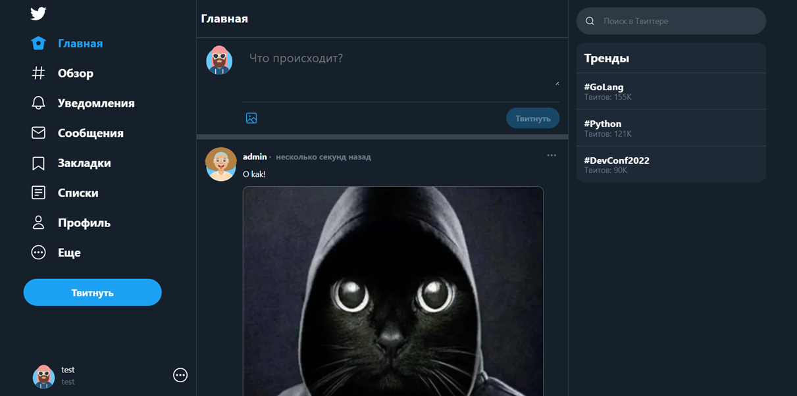
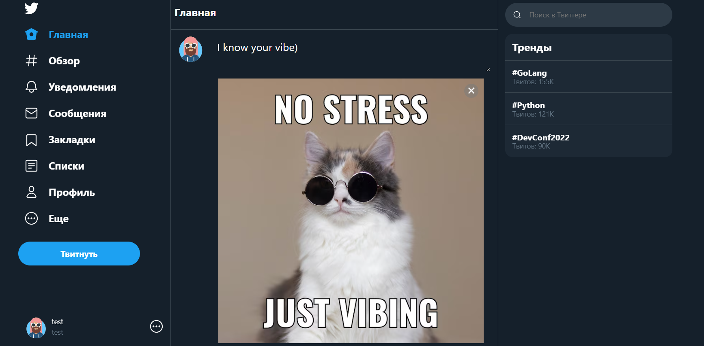
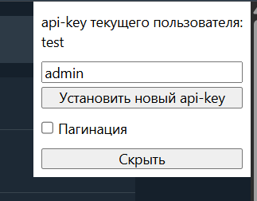
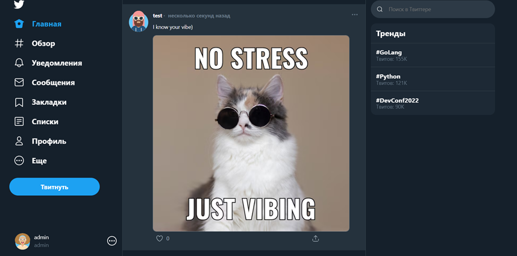

# 🐦 Twitter Clone на FastAPI

Проект микроблога, реализованный на FastAPI с использованием PostgreSQL, Docker и асинхронного стека.

## 🚀 Стек технологий

- FastAPI
- PostgreSQL
- SQLAlchemy
- Alembic
- Pydantic v2
- Docker
- pytest

## ⚙️ Установка

### 1. Клонирование проекта

```bash
  git clone https://github.com/DevAlhemy/TwitterClone.git
  cd TwitterClone
```

### 2. Создание `.env`

Скопируйте `.env.template` в `.env` и при необходимости отредактируйте переменные окружения.

```bash
  cp .env.template .env
```

### 3. 🚢 Запуск проекта через Docker

```bash
  docker-compose up -d --build
```

### Доступы

- Приложение: http://localhost:8000
- Документация: http://localhost:8000/docs

## 📌 Возможности

- Авторизация по API-ключу
- Публикация и удаление твитов
- Загрузка медиа
- Просмотр и лайк/анлайк твитов
- Подписки и отписки
- Получение ленты
- Получение профилей
- Покрытие маршрутов тестами

## 📷 Примеры интерфейса

### Главная страница


### Создание твита


### Ввод api-key


### Отображение твита со стороны подписчика


### Профиль пользователя


## 🧑‍💻 Автор

- Имя: DevAlhemy
- GitHub: https://github.com/DevAlhemy